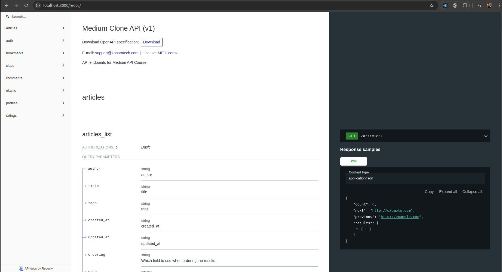

# medium-api-clone
Build Functional API With Docker, Celery, Redis For Medium Blog

# Tech Stack
- Python
- Django
- Django Rest Framework
- Redis
- Celery
- ElasticSearch
- Docker
- Kubernetes
- Bash

# Overview


# How To Get Started
Clone the repository
```bash
git clone git@github.com/kosamtech/medium-api-clone.git
```

create env files
```bash
touch .envs/.local/.django && touch .envs/.local/.postgres
```

update env vars for `.django`
```bash
CELERY_BROKER=
DOMAIN=
EMAIL_PORT=
CELERY_FLOWER_USER=
CELERY_FLOWER_PASSWORD=
SIGNING_KEY=
DJANGO_ENVIRONMENT=
ELASTICSEARCH_URL=
```

update env vars for `.postgres`

```bash
POSTGRES_HOST=
POSTGRES_PORT=
POSTGRES_DB=
POSTGRES_USER=
POSTGRES_PASSWORD=
DATABASE_URL=
```

Run the project as below
```bash
make build
```